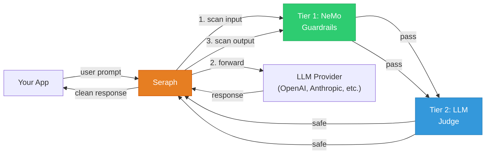
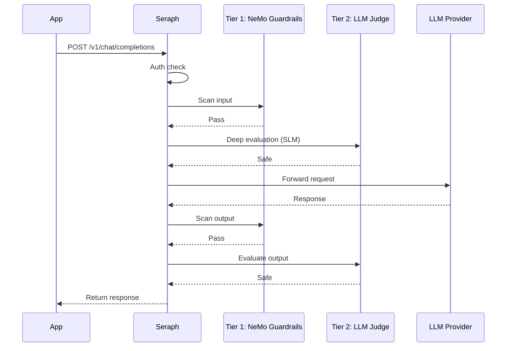

# Seraph — LLM Guardrail Proxy

[](https://sonarcloud.io/summary/new_code?id=0x0pointer_seraph)
[](https://sonarcloud.io/summary/new_code?id=0x0pointer_seraph)
[](https://sonarcloud.io/summary/new_code?id=0x0pointer_seraph)

Seraph is a transparent security proxy for LLM applications. Point your app at Seraph instead of the LLM — it scans every request and response through a two-tier guardrail pipeline, then blocks or logs threats.

- **Drop-in replacement** for any LLM API endpoint — zero code changes
- Works with **any LLM provider** (OpenAI, Anthropic, Azure, Ollama, vLLM, etc.)
- **Two-tier defense-in-depth** — semantic allow-list + deep LLM evaluation
- Configured with a **single YAML file** — no database, no frontend

## Architecture

Seraph uses a **two-tier scanning pipeline** inspired by the [AI firewall](https://eviltux.com/2025/05/21/the-dawn-of-the-ai-firewall/) allow-list approach:

```
Request text
    |
    v
+------------------------------+
| Tier 1: NeMo Guardrails     |
| (Colang semantic allow-list) |
+-------------+----------------+
              |
         Any block? --YES--> return 400
              |
              NO
              v
+------------------------------+
| Tier 2: LLM-as-a-Judge      |
| (LangGraph StateGraph)      |
| - classify node (SLM call)  |
| - decide node (threshold)   |
+-------------+----------------+
              |
       +------+------+
       v             v
    BLOCK          PASS
    (400)       forward to LLM
```

### Tier 1: NeMo Guardrails

A **semantic allow-list firewall** using [NVIDIA NeMo Guardrails](https://github.com/NVIDIA/NeMo-Guardrails). Instead of maintaining an ever-growing deny-list of forbidden phrases, you define **what users are allowed to ask** via Colang flow definitions. Anything that doesn't match an allowed intent is blocked by the fallback rail.

- Uses embedding similarity (configurable threshold) to match intents semantically
- `allow_free_text: false` enforces strict allow-list behavior
- Catches novel phrasings that keyword matching would miss
- Separate Colang files for input and output rails

### Tier 2: LLM-as-a-Judge (LangGraph)

A **small language model** evaluates requests that pass Tier 1 for deeper threats. Built as a [LangGraph](https://langchain-ai.github.io/langgraph/) `StateGraph` with two nodes:

1. **classify** — calls the SLM with a security evaluation prompt via `ChatPromptTemplate`
2. **decide** — applies a risk threshold to produce a pass/block verdict

Checks for: prompt injection, jailbreak attempts, harmful intent, data exfiltration, social engineering, and policy violations. Returns structured JSON with `verdict`, `risk_score`, `reasoning`, and `threats_detected`.

## How it works





## Quick Start

### 1. Install and run

```bash
git clone https://github.com/0x0pointer/seraph.git
cd seraph
pip install poetry && poetry install

# Set your LLM provider key
export UPSTREAM_API_KEY=sk-your-openai-key

# Start Seraph
SERAPH_CONFIG=config.yaml uvicorn app.main:app --host 0.0.0.0 --port 8000
```

Or with Docker:

```bash
docker compose up
```

### 2. Configure

Edit `config.yaml`:

```yaml
listen: "0.0.0.0:8000"
upstream: "https://api.openai.com"

api_keys:
  - "your-seraph-key-here"

# Tier 1: NeMo Guardrails
nemo_tier:
  enabled: true
  embedding_threshold: 0.85       # similarity threshold for intent matching
  model: "gpt-4o-mini"            # backing LLM for NeMo flow matching
  model_engine: "openai"

# Tier 2: LLM-as-a-Judge
judge:
  enabled: true
  model: "gpt-4o-mini"            # SLM for security evaluation
  # base_url: "http://localhost:11434/v1"  # uncomment for Ollama
  temperature: 0.0
  risk_threshold: 0.7             # score >= this = block
  run_on_every_request: true      # false = only when Tier 1 is uncertain
  prompt_file: "app/services/judge_prompt.txt"
```

### 3. Use it

Point your LLM client at Seraph instead of the LLM provider:

**OpenAI SDK:**

```python
from openai import OpenAI

client = OpenAI(
    base_url="http://localhost:8000/v1",
    api_key="your-seraph-key",
    default_headers={
        "X-Upstream-Auth": "Bearer sk-your-openai-key",
    },
)

response = client.chat.completions.create(
    model="gpt-4",
    messages=[{"role": "user", "content": "Hello!"}],
)
```

**Anthropic SDK:**

```python
import anthropic

client = anthropic.Anthropic(
    base_url="http://localhost:8000",
    api_key="your-seraph-key",
    default_headers={
        "X-Upstream-Auth": "Bearer sk-ant-your-key",
    },
)

message = client.messages.create(
    model="claude-sonnet-4-20250514",
    max_tokens=1024,
    messages=[{"role": "user", "content": "Hello!"}],
)
```

**curl:**

```bash
curl -X POST http://localhost:8000/v1/chat/completions \
  -H "Content-Type: application/json" \
  -H "Authorization: Bearer your-seraph-key" \
  -H "X-Upstream-Auth: Bearer sk-your-openai-key" \
  -d '{"model": "gpt-4", "messages": [{"role": "user", "content": "Hello!"}]}'
```

## Configuration Reference

### `nemo_tier` — Tier 1: NeMo Guardrails

| Field | Default | Description |
|-------|---------|-------------|
| `enabled` | `true` | Enable/disable the NeMo tier |
| `config_dir` | `app/services/nemo_config` | Directory containing Colang files and NeMo config |
| `embedding_threshold` | `0.85` | Cosine similarity threshold for intent matching (lower = more permissive) |
| `model` | `gpt-4o-mini` | Backing LLM for NeMo's internal flow matching |
| `model_engine` | `openai` | LLM engine (`openai`, `azure`, etc.) |
| `api_key` | `null` | API key for NeMo's LLM (falls back to `upstream_api_key`) |

### `judge` — Tier 2: LLM-as-a-Judge

| Field | Default | Description |
|-------|---------|-------------|
| `enabled` | `true` | Enable/disable the LLM judge |
| `model` | `gpt-4o-mini` | SLM for security evaluation |
| `base_url` | `null` | Custom endpoint for local models (Ollama: `http://localhost:11434/v1`) |
| `api_key` | `null` | API key (falls back to `upstream_api_key`) |
| `temperature` | `0.0` | LLM temperature (keep at 0 for deterministic evaluation) |
| `max_tokens` | `512` | Max response tokens for the judge |
| `risk_threshold` | `0.7` | Risk score >= this value triggers a block |
| `prompt_file` | `app/services/judge_prompt.txt` | Path to the security evaluation rubric |
| `run_on_every_request` | `true` | If `false`, judge only runs when Tier 1 is uncertain |
| `uncertainty_band_low` | `0.70` | Lower bound of the uncertainty band |
| `uncertainty_band_high` | `0.85` | Upper bound of the uncertainty band |

### Customizing NeMo Flows

The Colang flow definitions live in `app/services/nemo_config/`:

```
app/services/nemo_config/
  config.yml        # NeMo settings (model, embedding threshold)
  input_rails.co    # Allowed user intent flows
  output_rails.co   # Allowed assistant output flows
```

To allow a new user intent, add it to `input_rails.co`:

```colang
define user ask about weather
    "What is the weather like today?"
    "Will it rain tomorrow?"
    "Temperature forecast for this week"

define flow allowed weather
    user ask about weather
    bot allow request
```

NeMo uses embedding similarity, so 5-10 example phrases per intent are enough to generalize to novel phrasings.

### Customizing the Judge Prompt

Edit `app/services/judge_prompt.txt` to change what the LLM judge evaluates. The prompt should instruct the SLM to return JSON with `verdict`, `risk_score`, `reasoning`, and `threats_detected`.

## How the Auth Swap Works

| Header | What it is | Who uses it |
|--------|-----------|-------------|
| `Authorization: Bearer <seraph-key>` | Seraph's own API key | Seraph checks this, then strips it |
| `X-Upstream-Auth: Bearer <provider-key>` | Your LLM provider key | Seraph forwards this as `Authorization` to the LLM |
| `X-Upstream-URL: <url>` | Override upstream URL | Optional — overrides `upstream` in config.yaml |

## Supported Providers

| Provider | Format | Example `upstream` |
|----------|--------|-------------------|
| OpenAI | `messages[].content: str` | `https://api.openai.com` |
| Azure OpenAI | Same as OpenAI | `https://your-resource.openai.azure.com` |
| Anthropic | `messages[].content: [{type, text}]` | `https://api.anthropic.com` |
| Ollama | Same as OpenAI | `http://localhost:11434` |
| vLLM | Same as OpenAI | `http://localhost:8000` |

## Streaming

Streaming (`"stream": true`) is supported. Input is scanned before forwarding; the SSE stream is passed through transparently. Output scanning is skipped for streaming responses.

## API Reference

| Endpoint | Method | Description |
|----------|--------|-------------|
| `/{path}` | POST | Transparent proxy with scanning |
| `/{path}` | GET/PUT/DELETE/PATCH | Pass-through (no scanning) |
| `/health` | GET | Health check |
| `/reload` | POST | Hot-reload config and all tiers |

## Hot Reload

```bash
curl -X POST http://localhost:8000/reload

# Or send SIGHUP
kill -HUP $(pgrep -f "uvicorn app.main")
```

Reloads NeMo Colang definitions, judge prompt, and all configuration without restarting.

## Development

```bash
pip install poetry
poetry install
poetry run pytest tests/ -v
```

## License

GNU Affero General Public License v3.0 — see [LICENSE](LICENSE).
