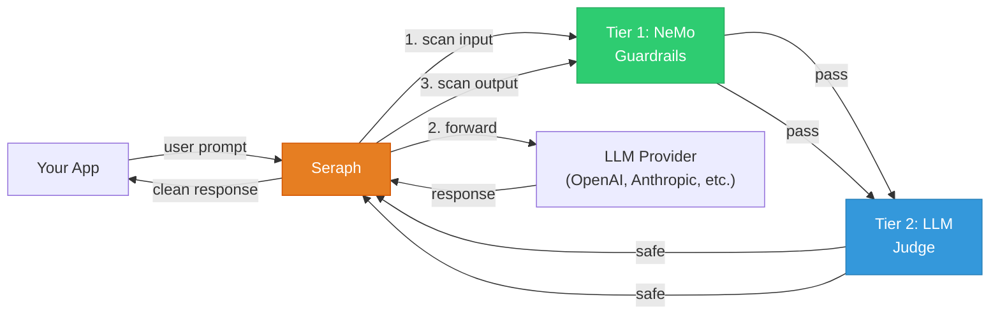
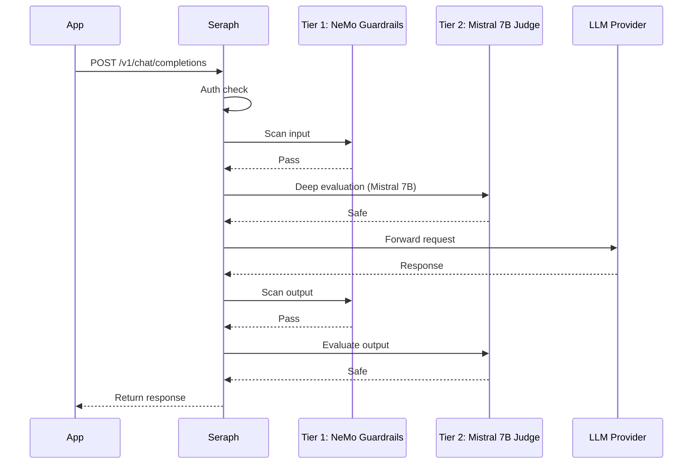

# Seraph — LLM Guardrail Proxy

[](https://sonarcloud.io/summary/new_code?id=0x0pointer_seraph)
[](https://sonarcloud.io/summary/new_code?id=0x0pointer_seraph)
[](https://sonarcloud.io/summary/new_code?id=0x0pointer_seraph)

Seraph is a transparent security proxy for LLM applications. Point your app at Seraph instead of the LLM — it scans every request and response through a two-tier guardrail pipeline, then blocks or logs threats.

- **Drop-in replacement** for any LLM API endpoint — zero code changes
- Works with **any LLM provider** (OpenAI, Anthropic, Azure, Ollama, vLLM, etc.)
- **Two-tier defense-in-depth** — semantic allow-list + local Mistral 7B evaluation
- Configured with a **single YAML file** — no database, no frontend

## Architecture



**Tier 1** uses [NVIDIA NeMo Guardrails](https://github.com/NVIDIA/NeMo-Guardrails) as a semantic allow-list firewall — you define what users *are allowed* to ask via Colang flows; everything else is blocked. **Tier 2** runs a local [Mistral 7B](https://mistral.ai/) model via [LangGraph](https://langchain-ai.github.io/langgraph/) to evaluate requests for prompt injection, jailbreaks, data exfiltration, and policy violations.

## How it works



## Quick Start

```bash
git clone https://github.com/0x0pointer/seraph.git
cd seraph
pip install poetry && poetry install

export UPSTREAM_API_KEY=sk-your-openai-key
SERAPH_CONFIG=config.yaml uvicorn app.main:app --host 0.0.0.0 --port 8000
```

Or with Docker:

```bash
docker compose up
```

## Configuration

Edit `config.yaml`:

```yaml
listen: "0.0.0.0:8000"
upstream: "https://api.openai.com"

api_keys:
  - "your-seraph-key-here"

nemo_tier:
  enabled: true
  embedding_threshold: 0.85
  model: "gpt-4o-mini"

judge:
  enabled: true
  model: "mistral"                       # local Mistral 7B via Ollama
  base_url: "http://localhost:11434/v1"
  risk_threshold: 0.7
```

Customize allowed intents in `app/services/nemo_config/input_rails.co` and the judge evaluation rubric in `app/services/judge_prompt.txt`.

## Usage

Point your LLM client at Seraph instead of the provider:

```python
from openai import OpenAI

client = OpenAI(
    base_url="http://localhost:8000/v1",
    api_key="your-seraph-key",
    default_headers={"X-Upstream-Auth": "Bearer sk-your-openai-key"},
)

response = client.chat.completions.create(
    model="gpt-4",
    messages=[{"role": "user", "content": "Hello!"}],
)
```

### Auth Headers

| Header | Purpose |
|--------|---------|
| `Authorization: Bearer <seraph-key>` | Seraph authenticates the client, then strips it |
| `X-Upstream-Auth: Bearer <provider-key>` | Forwarded as `Authorization` to the LLM provider |
| `X-Upstream-URL: <url>` | Optional — overrides `upstream` from config |

## API

| Endpoint | Method | Description |
|----------|--------|-------------|
| `/{path}` | POST | Transparent proxy with scanning |
| `/{path}` | GET/PUT/DELETE/PATCH | Pass-through (no scanning) |
| `/health` | GET | Health check |
| `/reload` | POST | Hot-reload config and all tiers |

Streaming (`"stream": true`) is supported — input is scanned before forwarding; the SSE stream is passed through transparently.

## Development

```bash
poetry install
poetry run pytest tests/ -v
```

## License

GNU Affero General Public License v3.0 — see [LICENSE](LICENSE).
