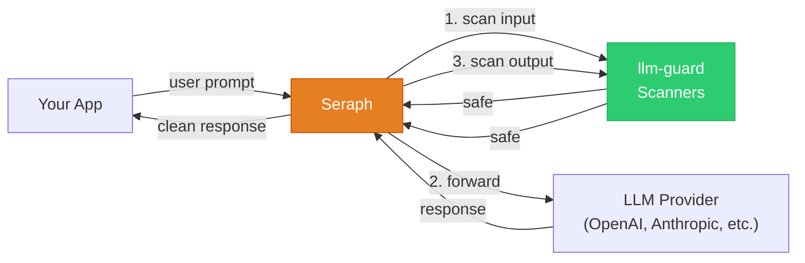

# Seraph — LLM Guardrail Proxy

[](https://sonarcloud.io/summary/new_code?id=0x0pointer_seraph)
[](https://sonarcloud.io/summary/new_code?id=0x0pointer_seraph)
[](https://sonarcloud.io/summary/new_code?id=0x0pointer_seraph)

Seraph is a transparent security proxy for LLM applications. Point your app at Seraph instead of the LLM — it scans every request and response for prompt injection, toxicity, secrets, and other threats, then blocks, sanitizes, or logs them.

- **Drop-in replacement** for any LLM API endpoint — zero code changes
- Works with **any LLM provider** (OpenAI, Anthropic, Azure, Ollama, vLLM, etc.)
- Works behind **any frontend** (chatbot, reverse proxy, gateway, custom app)
- Configured with a **single YAML file** — no database, no frontend
- Uses [llm-guard](https://llm-guard.com/) scanners with parallel execution
- Includes text canonicalization to defeat evasion tricks (leetspeak, homoglyphs, unicode)

## How it works



Seraph acts as a **transparent proxy** between your app and the LLM. It intercepts every request, scans the input, forwards to the upstream LLM, scans the output, and returns the result. If a threat is detected at any point, the request is blocked before it reaches the LLM (or before the response reaches your app).

## Quick Start

### 1. Install and run

```bash
git clone https://github.com/0x0pointer/seraph.git
cd seraph
pip install poetry && poetry install

# Start Seraph
SERAPH_CONFIG=config.yaml uvicorn app.main:app --host 0.0.0.0 --port 8000
```

Or with Docker:

```bash
docker compose up
```

### 2. Configure

Edit `config.yaml` — this single file controls everything:

```yaml
listen: "0.0.0.0:8000"

# Default LLM backend. Override per-request with the X-Upstream-URL header.
upstream: "https://api.openai.com"

# Seraph's own API keys. Clients must send one as "Authorization: Bearer <key>".
# Leave empty for open mode (no auth).
api_keys:
  - "your-seraph-key-here"

logging:
  level: info
  audit: true           # log every scan result
  audit_file: null      # null = stdout JSON, set a path for SQLite

# Which scanners to run. Remove this section entirely to use built-in defaults.
scanners:
  input:
    - type: PromptInjection
      threshold: 0.8
      on_fail: block
    - type: BanSubstrings
      params:
        substrings: ["ignore previous instructions"]
      on_fail: block
  output:
    - type: Toxicity
      threshold: 0.7
      on_fail: block
```

### 3. Use it

Point your LLM client at Seraph instead of the LLM provider. That's it — Seraph handles input scanning, forwarding, output scanning, and response delivery transparently.

**OpenAI SDK — zero code changes:**

```python
from openai import OpenAI

client = OpenAI(
    base_url="http://localhost:8000/v1",           # Point at Seraph
    api_key="your-seraph-key",                     # Seraph key (NOT your OpenAI key)
    default_headers={
        "X-Upstream-Auth": "Bearer sk-your-openai-key",  # Real OpenAI key
    },
)

response = client.chat.completions.create(
    model="gpt-4",
    messages=[{"role": "user", "content": "Hello!"}],
)
```

**Anthropic SDK:**

```python
import anthropic

client = anthropic.Anthropic(
    base_url="http://localhost:8000",              # Point at Seraph
    api_key="your-seraph-key",                     # Seraph key
    default_headers={
        "X-Upstream-Auth": "Bearer sk-ant-your-key",  # Real Anthropic key
    },
)

message = client.messages.create(
    model="claude-sonnet-4-20250514",
    max_tokens=1024,
    messages=[{"role": "user", "content": "Hello!"}],
)
```

**curl:**

```bash
curl -X POST http://localhost:8000/v1/chat/completions \
  -H "Content-Type: application/json" \
  -H "Authorization: Bearer your-seraph-key" \
  -H "X-Upstream-Auth: Bearer sk-your-openai-key" \
  -H "X-Upstream-URL: https://api.openai.com" \
  -d '{
    "model": "gpt-4",
    "messages": [{"role": "user", "content": "Hello!"}]
  }'
```

## How the auth swap works

| Header | What it is | Who uses it |
|--------|-----------|-------------|
| `Authorization: Bearer <seraph-key>` | Seraph's own API key | Seraph checks this, then strips it |
| `X-Upstream-Auth: Bearer <provider-key>` | Your LLM provider key | Seraph forwards this as `Authorization` to the LLM |
| `X-Upstream-URL: <url>` | Override upstream URL | Optional — overrides the `upstream` in config.yaml |

If `api_keys` is empty in your config (open mode), the `Authorization` header can be any non-empty string — the SDK requires it but Seraph won't check it.

## Supported providers

Seraph auto-detects the API format from the request body:

| Provider | Format | Example `upstream` |
|----------|--------|-------------------|
| OpenAI | `messages[].content: str` | `https://api.openai.com` |
| Azure OpenAI | Same as OpenAI | `https://your-resource.openai.azure.com` |
| Anthropic | `messages[].content: [{type, text}]` | `https://api.anthropic.com` |
| Ollama | Same as OpenAI | `http://localhost:11434` |
| vLLM | Same as OpenAI | `http://localhost:8000` |
| LiteLLM | Same as OpenAI | Your LiteLLM proxy URL |

Any provider that follows the OpenAI or Anthropic message format works out of the box.

## Streaming

Streaming requests (`"stream": true`) are supported. Input is scanned before forwarding, and the SSE stream is passed through transparently. Output scanning is skipped for streaming responses (the chunks are forwarded as-is).

## Scanner Actions

When a scanner detects a threat, the `on_fail` setting controls what happens:

| Action | What happens |
|--------|-------------|
| `block` | Reject the request entirely (default) |
| `fix` | Auto-sanitize the text (e.g., redact secrets) and let it through |
| `monitor` | Log the violation but allow the request through |
| `reask` | Reject with a hint telling the user what to fix |

## API Reference

| Endpoint | Method | Description |
|----------|--------|-------------|
| `/{path}` | POST | Transparent proxy — scans input, forwards to upstream, scans output |
| `/{path}` | GET/PUT/DELETE/PATCH | Pass-through to upstream (no scanning) |
| `/health` | GET | Health check |
| `/reload` | POST | Hot-reload config and scanners |

## Hot Reload

Change scanners or settings without restarting:

```bash
# Edit config.yaml, then:
curl -X POST http://localhost:8000/reload

# Or send SIGHUP
kill -HUP $(pgrep -f "uvicorn app.main")
```

## Development

```bash
pip install poetry
poetry install
poetry run pytest tests/ -v
```

## License

GNU Affero General Public License v3.0 — see [LICENSE](LICENSE).
